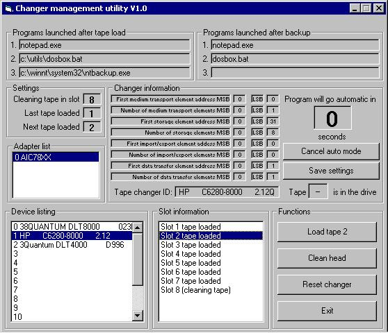



## TapeChanger

### Description

This program uses the ASPI layer to manage the basic functions of a tape changer or autoloader. It can inventory the magazine, load and unload a specified tape and clean the tape drive head. It also has an automatic mode. WARNINNG. LARGE file (1.08Mb). Zip also contains SCSI documentation from ANSI and HP, as well as my own document. This program shows how to send RAW SCSI commands to a changer or other device, and get it to do something.
 
### More Info
 
None. It does require an .INI file - provided.

This code requires a compatible ASPI SCSI card installed and a tape changer whose SCSI IDs for the change and tape drive are separate.

             |
---                |---
**Submitted On**   |2002-03-08 22:07:54
**By**             |[Mark Borchers](https://github.com/Planet-Source-Code/PSCIndex/blob/master/ByAuthor/mark-borchers.md)
**Level**          |Intermediate
**User Rating**    |5.0 (10 globes from 2 users)
**Compatibility**  |VB 6\.0
**Category**       |[Files/ File Controls/ Input/ Output](https://github.com/Planet-Source-Code/PSCIndex/blob/master/ByCategory/files-file-controls-input-output__1-3.md)
**World**          |[Visual Basic](https://github.com/Planet-Source-Code/PSCIndex/blob/master/ByWorld/visual-basic.md)
**Archive File**   |[TapeChange60365382002\.zip](https://github.com/Planet-Source-Code/mark-borchers-tapechanger__1-32454/archive/master.zip)

